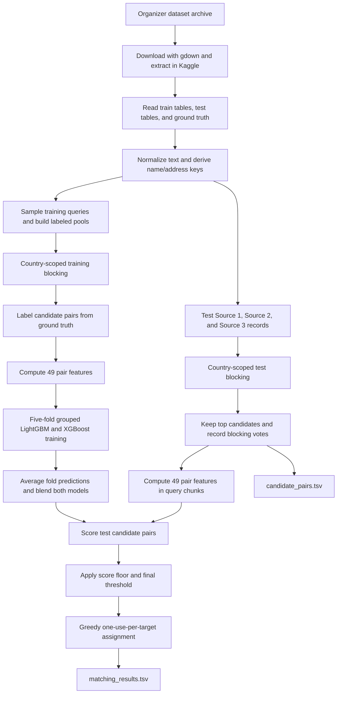

# Business Entity Resolution - Detailed Methodology

## Problem

The task is to find records in **Source 2** and **Source 3** that refer to each business in **Source 1**. A Source 1 record may have zero, one, or multiple matching entity IDs. The system produces a comma-separated list of predicted IDs for each Source 1 test record.

## Pipeline Overview

This section explains the implemented workflow from data acquisition through submission generation. The notebook contains the parameter values below; explanations of *why* those values are useful are engineering rationale inferred from the approach, since the code does not record a tuning log for every choice.



## Data Collection and Training Set Construction

The notebook obtains the organizer-provided dataset archive from the Google Drive file ID configured in its download cell. It uses `gdown` to download the archive to `/kaggle/working/student_resource.zip`, extracts it under `/kaggle/working/`, and deletes the downloaded ZIP after extraction. It then reads the train and test TSV files from the extracted `dataset/train` and `dataset/test` directories. The organizer dataset itself is not committed to this repository.

The training inputs are Source 1, Source 2, Source 3, and the ground-truth table. Ground-truth IDs are parsed into sets, which makes it possible to label each proposed pair with a direct entity-ID membership check. In test inference, only `entity_id`, `business_name`, `business_address`, and `country` are read from each source table.

To bound training size, the notebook samples at most **50,000 Source 1 rows** with `random_state=42`. For those queries, it keeps every target-catalog record known to be a positive match, then samples up to **1,500,000 non-positive records per target catalog** as a negative pool. Keeping positives prevents random negative sampling from dropping known matches; the large negative pool supplies varied hard and easy nonmatches for blocking and training.

The negative pool is a pool of catalog records, not a guarantee that all of them become model rows. Only the records retrieved by blocking become candidate-pair examples. This two-stage design limits expensive pair-feature computation to plausible pairs.

## Cleaning and Normalization

The implementation applies Unicode NFKC normalization and `Unidecode` transliteration before lowercasing. It normalizes `&` to `and` and `@` to `at`, removes punctuation, and collapses repeated whitespace. For names, it removes common legal suffixes (for example, `Ltd`, `Inc`, and `LLC`) and DBA phrases (such as `trading as`). Removing these often non-distinctive additions lets otherwise equivalent business names compare more directly. For addresses, it expands common street and unit abbreviations to reduce formatting variation.

From the cleaned text, it derives a compact name with spaces removed; sets of all digit groups and 5- or 6-digit postal codes; the first address number; a lowercased, trimmed country key; and a Soundex-like code for the first name token. These additional forms preserve useful identity clues that punctuation and formatting cleanup alone would lose.

## Candidate Generation / Blocking Strategy

Comparing every Source 1 record with every target record would create a prohibitively large Cartesian product. The notebook therefore uses **blocking**: it indexes the two target catalogs and compares each query only with records sharing one or more keys. Source 1 is matched separately against Source 2 and Source 3, and the test-time loop first partitions records by normalized country. This removes cross-country comparisons and reduces both false candidates and computation.

The blocking keys include:

- Exact compact business name and a compact-name prefix.
- Sorted full name tokens, individual name tokens of at least four characters, and adjacent name-token bigrams.
- A Soundex-like code for the first name token.
- Postal codes and combinations of the first name token with a postal code or address number.
- Combinations of the first address token with an address number or first name token.

The implementation builds an inverted index from each key to catalog row positions. Query keys retrieve matching positions; each retrieved record gains one vote per shared key. Keys that point to more than **600 records** are ignored because such common keys create large, weakly-informative posting lists. The system keeps the top **45 candidates per query per target catalog**, ranked by vote count. That limit controls downstream feature and model work; retaining several complementary keys helps recover pairs even when one representation differs.

The choice to combine exact compact-name keys with token, phonetic, postal, and address keys is intended to balance precision and recall: exact keys are selective, while token and phonetic keys can recover misspellings or reordered words, and postal/address keys add location evidence. These are design rationales, not separate ablation results documented by the notebook.

In the notebook's sampled training evaluation, blocking pair recall was reported as **87.17%**. This is a run-specific result on the sampled training pools; it is not a guarantee of test-set recall or a leaderboard result. Blocking recall is an important ceiling: the classifier cannot recover a true match that candidate generation did not produce.

## Feature Engineering

After blocking, each query-candidate pair is represented by **49 numeric features**. Features are calculated on the normalized values so differences in capitalization, punctuation, common suffixes, and address abbreviations have less impact.

| Feature family | What is compared | Why it helps |
| --- | --- | --- |
| Fuzzy name similarity | RapidFuzz ratio, token-sort, token-set, partial ratio, and Jaro-Winkler scores | Covers spelling edits, reordered tokens, partial names, and common prefixes. |
| Name overlap and shape | Token and character Jaccard overlap, first-token equality, shared-token counts, IDF-weighted overlap, compact-name equality, containment, length and token-count differences | Captures exact shared words and distinguishes informative shared tokens from very common ones. |
| Fuzzy address similarity | Address ratio, token-set and partial scores, token/character overlap, Indel and normalized Levenshtein similarity | Handles address punctuation/order differences while retaining a measure of overall textual agreement. |
| Address/location identifiers | House-number equality and difference, overlap of all numeric groups, exact postal match and three-character postal prefix match | Adds highly discriminative locality evidence; a correct name with a conflicting address can be downgraded by the model. |
| TF-IDF text similarity | Word unigram and bigram cosine similarity for names and addresses | Weights rarer words more heavily and gives a compact semantic-like lexical comparison without a neural embedding model. |
| Candidate and source context | Number of shared blocking keys, source-catalog flag, country equality, phonetic equality, candidate similarity gap and count of near-best name candidates | Represents retrieval evidence, which catalog supplied the candidate, and how its score compares with alternatives for the same query. |

The TF-IDF vectorizers use word features with `ngram_range=(1, 2)`. Name and address vectors are fit separately. The per-target name-token IDF dictionary is also built separately for Source 2 and Source 3. The resulting feature matrix is explicitly stored as `float32`, reducing its memory footprint relative to default `float64` values.

## Model Selection and Training

The notebook uses two **gradient-boosted decision-tree** classifiers, LightGBM and XGBoost. This model choice fits the engineered representation: the input is a fixed-width table of mixed numeric similarity, boolean agreement, source, and candidate-context signals. Tree models can learn nonlinear combinations (for example, a strong name match together with an address-number match) without requiring a separate scaling step. The notebook does not compare against other model families, so this is the implementation choice rather than a documented benchmark proving superiority.

### Cross-validation design

The candidate-pair examples are combined for both target catalogs. A five-fold `GroupKFold` uses the Source 1 query index as its group. All candidates for a query stay together in one fold, avoiding a validation split where candidates for the same query appear in both training and validation. Each fold trains one model of each type. Early stopping uses that fold's validation set; up to 1,000 boosting rounds are allowed, and training stops after 50 rounds without improvement.

### Hyperparameters used

| Setting | LightGBM | XGBoost | Purpose / rationale |
| --- | --- | --- | --- |
| Objective | `binary` | `binary:logistic` | Predicts whether a candidate pair is a match; XGBoost emits probabilities directly. |
| Validation metric | `auc` | `auc` | Measures ranking quality across thresholds while the final decision threshold is selected separately. |
| Boosting method | `gbdt` | `tree_method=hist` | Gradient-boosted trees; histogram-based split finding is efficient on tabular data. |
| Device | `gpu` | `cuda` | Uses GPU-enabled training to reduce runtime on the configured Kaggle accelerator. |
| Learning rate | `0.05` | `0.05` | Moderates each boosting update; paired with early stopping and a larger round ceiling. |
| Tree complexity | `num_leaves=63` | `max_depth=6` | Allows nonlinear feature interactions while limiting tree size. |
| Row/feature sampling | `feature_fraction=0.8` | `subsample=0.8`, `colsample_bytree=0.8` | Trains each tree on a subset of rows/features to add diversity and control per-tree work. |
| Random seed | `42` | `42` | Makes the configured sampling/training randomness repeatable where supported. |
| Boosting-round ceiling | 1,000 | 1,000 | Allows continued fitting when validation improves; early stopping usually ends earlier. |
| Early stopping | 50 rounds | 50 rounds | Limits wasted training after validation performance stops improving. |
| Other explicit settings | `verbose=-1` | `verbose_eval=False` | Suppresses per-iteration training output so notebook logs stay manageable. |

The seed for LightGBM is passed as `seed=42`; XGBoost uses `random_state=42`. Exact determinism can still depend on GPU kernels, library versions, and hardware. The code does not specify an XGBoost `max_bin`, `min_child_weight`, regularization settings, or LightGBM `max_bin`; those remain library defaults.

### Other explicit pipeline parameters

| Parameter | Value | Role and rationale |
| --- | --- | --- |
| `SAMPLE_S1` | 50,000 | Upper bound on training queries to control the number of candidate groups. |
| `NEG_POOL` | 1,500,000 per target catalog | Upper bound on sampled non-positive records; known positive records are added separately. |
| `RS` | 42 | Shared seed for query and negative-pool sampling, and LightGBM. |
| `TOPK_BLOCK` | 45 | Maximum candidates retained per query and catalog, bounding pair-feature work. |
| `BLOCK_CAP` | 600 | Posting-list size limit; suppresses keys too common to be selective. |
| TF-IDF `analyzer` | `word` | Uses word tokens in the name and address text. |
| TF-IDF `ngram_range` | `(1, 2)` | Captures individual words and adjacent two-word phrases. Other vectorizer settings use scikit-learn defaults. |
| `FLOOR` | 0.12 | Minimum score for a test candidate to enter the assignment pool. |
| `OPTIMAL_THRESHOLD` | 0.70 | Final score threshold for writing a match; this is the notebook's chosen value after reporting a threshold sweep. |
| `CHUNK` | 100,000 | Maximum Source 1 query batch size during test inference, limiting temporary feature arrays. |

The notebook reports its threshold sweep but does not show a separate hyperparameter search for model settings, a systematic ablation study, or a search procedure for the 0.70 operating threshold. The 0.70 value is selected in the code and corresponds to one of the reported validation thresholds.

### Ensemble and inference score

For each learner, the notebook averages predictions from its five fold models. It then gives each learner equal weight:

```text
blended_probability = 0.5 * mean(LightGBM fold probabilities)
                    + 0.5 * mean(XGBoost fold probabilities)
```

The ensemble combines two implementations of boosted trees and reduces reliance on one fitted fold/model. Equal weighting is what the notebook implements; it does not report a separate weight search.

## Runtime and Memory Optimizations

The notebook applies several measures to keep a large-catalog matching job feasible:

1. **Sample training queries and cap the negative pool.** Training uses up to 50,000 Source 1 rows and at most 1.5 million sampled non-positive catalog rows per target, while retaining known positives. This bounds the training search space instead of using every possible query-catalog pair.
2. **Block before computing pair features.** Expensive RapidFuzz, edit-distance, and TF-IDF pair computations run only on candidates retrieved by the index, capped at 45 per query and catalog. High-frequency keys over 600 entries are skipped.
3. **Partition by country.** Indexes and candidate generation operate on a country subset at a time, reducing the active catalog/index size and avoiding cross-country pairs.
4. **Use compact numerical storage.** Pair features and model arrays use `float32`; TF-IDF matrices are sparse scikit-learn matrices, so the mostly-zero text vectors are not expanded into dense arrays.
5. **Batch inference queries.** Test inference processes Source 1 queries in chunks of **100,000** (`CHUNK=100000`) for each country and target catalog, rather than constructing all test candidate features in one operation.
6. **Release temporary data.** The code deletes source DataFrames and country-specific indexes after use and calls `gc.collect()` between major stages and catalog passes.
7. **Use compiled/vectorized similarity routines and GPU training.** RapidFuzz's `cpdist` evaluates arrays of string pairs with multiple workers; LightGBM and XGBoost are configured for GPU/CUDA training and prediction.
8. **Write outputs incrementally.** Result rows are flushed after each country, so completed countries are already written to disk if a later stage encounters a runtime problem.

These measures reduce the volume of work and peak intermediate allocations; they do not guarantee execution will fit every machine. The training code still materializes the candidate feature matrix for the sampled training set, and actual resource use depends on candidate counts, catalog sizes, GPU memory, and library builds.

The notebook keeps fitted models in memory for inference but does not serialize them as reusable artifacts. Running the notebook again repeats the data preparation and training stages.

## Decision Rules and Outputs

During test inference, candidate scores below **0.12** are excluded from the assignment pool. The remaining candidates are sorted by score across the queries in a country, and a target entity ID can be assigned to at most one Source 1 record within that country across the two target catalogs. Final matches are written only when their blended score is at least **0.70**. The thresholds serve different purposes: `0.12` limits which predictions participate in assignment, while `0.70` is the final acceptance threshold.

The notebook writes two tab-separated files under `/kaggle/working/output/`:

- `matching_results.tsv`: `source1_entity_id` and comma-separated `matched_entity_ids`. A row is written for each Source 1 test record; the match list is empty when no prediction passes the final rules.
- `candidate_pairs.tsv`: `source1_entity_id` and comma-separated `candidate_entity_ids`. This records candidates generated by blocking, before score-threshold and assignment filtering. Each final match should therefore also occur in that query's candidate list.

## Validation Results Recorded in the Notebook

The sampled out-of-fold evaluation reports blended AUC **0.99986**. The notebook evaluates macro precision, recall, and F0.5 at thresholds **0.50, 0.60, 0.70, 0.78, and 0.85**. At **0.70**, it reports macro precision **0.9871**, macro recall **0.8405**, and macro F0.5 **0.9184**.

These figures are the notebook's threshold evaluation on sampled training queries and candidate pools. They do not measure the final one-to-one test assignment, and they are not leaderboard results.

## Other Relevant Information, Reproducibility, and Limitations

- The implementation is the notebook at `code/business_entity_resolution/src/amazon-ml-challenge-team-heuristics.ipynb`.
- The training and test datasets were provided by the challenge organizers. Kaggle is the execution environment; the notebook downloads the organizer-provided archive from its configured Google Drive link and extracts it into the Kaggle working directory. The archive is not included in this repository.
- Fixed sampling seeds make the intended sampling reproducible, but results may still depend on dependency versions, hardware, and input row ordering.
- Candidate generation limits computation by skipping high-frequency keys and keeping only the top 45 candidates per query and target catalog. A true match omitted at this stage cannot be recovered by the scoring models.
- The pipeline expects a Kaggle environment with internet access, GPU support, and enough memory for candidate generation and model training.
- The leaderboard-uploaded result file is not present in this checkout, so the final submitted predictions cannot be verified from the repository alone.
